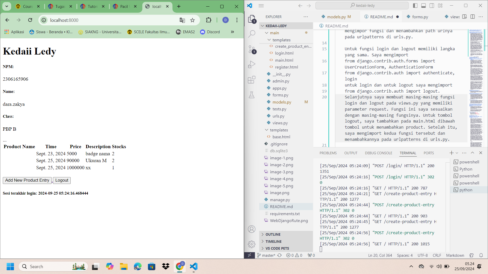

# TUGAS 5
<!-- Tugas 4 ada dibawah -->
**Jika terdapat beberapa CSS selector untuk suatu elemen HTML, jelaskan urutan prioritas pengambilan CSS selector tersebut!**
    CSS memiliki aturan yang disebut "specificity" atau kekhususan yang menentukan urutan prioritas saat beberapa selector digunakan pada elemen yang sama. Urutannya adalah:

    1. Inline styles: Gaya yang langsung ditulis dalam atribut elemen HTML (misalnya `
`) memiliki prioritas tertinggi.
    2. ID selector: Menggunakan tanda pagar (#) diikuti oleh ID elemen (misalnya #header) memiliki prioritas lebih tinggi daripada class atau elemen biasa.
    3. Class, attribute, dan pseudo-class selector: Menggunakan titik untuk class (misalnya `.button`), atribut (misalnya `[type="text"]`), dan pseudo-class (misalnya `:hover`) berada di bawah ID dalam hal prioritas.
    4. Element dan pseudo-element selector: Selector elemen (misalnya `p`, `h1`) dan pseudo-elemen (misalnya `::before`, `::after`) memiliki prioritas terendah. Jika ada dua selector dengan level prioritas yang sama, selector yang muncul terakhir dalam urutan kode akan digunakan.

**Mengapa responsive design menjadi konsep yang penting dalam pengembangan aplikasi web? Berikan contoh aplikasi yang sudah dan belum menerapkan responsive design!**
    Responsive design penting karena memungkinkan tampilan website menyesuaikan dengan berbagai ukuran layar (seperti mobile, tablet, desktop). Selain itu, responsive design penting untuk meningkatkan pengalaman pengguna di berbagai perangkat dan mengurangi kebutuhan untuk membuat versi website terpisah (misalnya versi desktop dan versi mobile). Contoh yang sudah menerapkan responsive design: Twitter, YouTube. Contoh yang belum: beberapa website lama yang tampilan desktopnya tidak berubah ketika diakses di ponsel, misalnya SiakNG.

**Jelaskan perbedaan antara margin, border, dan padding, serta cara untuk mengimplementasikan ketiga hal tersebut!**
    - Margin: Jarak di luar elemen, memberikan ruang antara elemen dengan elemen lainnya. Contohnya: margin: 20px; akan memberikan jarak 20px di luar elemen tersebut. 
    - Border: Garis yang mengelilingi elemen, memberikan batas yang terlihat di sekitar elemen. Misalnya, border: 2px solid black; akan memberikan garis hitam dengan ketebalan 2px di sekitar elemen. 
    - Padding: Jarak di dalam elemen, yaitu antara konten elemen (misalnya teks) dan tepi dalam dari elemen tersebut. Contoh, padding: 15px; akan memberikan ruang 15px di dalam elemen antara konten dan border. 

**Jelaskan konsep flex box dan grid layout beserta kegunaannya!**
    Flexbox digunakan untuk menyusun elemen dalam satu dimensi, baik itu baris atau kolom. Flexbox digunakan untuk mengatur tata letak elemen secara dinamis, seperti menu navigasi atau tata letak yang berubah sesuai ukuran layar. 
    Grid layout digunakan untuk menyusun elemen dalam dua dimensi, baris dan kolom, sehingga cocok untuk tata letak yang lebih kompleks seperti halaman web atau dashboard. Grid memberikan kontrol yang lebih besar untuk mendefinisikan ukuran baris, kolom, dan celah di antara elemen.

**Jelaskan bagaimana cara kamu mengimplementasikan checklist di atas secara step-by-step (bukan hanya sekadar mengikuti tutorial)!**
    ***Menambahkan edit dan hapus product.
    Untuk mengimplementasikan fungsi ini, saya menambahkan fungsi baru pada views.py berupa edit_product dan delete_product. Fungsi ini sama-sama berisi parameter request dan id yang akan mengambil object product entry mana yan ingin diambil. Pada bagian akhir masing-masing fungsi akan mereturn ke edit_product.html dan kembali ke show_main. 

    Selanjutnya, saya mengimport fungsi-fungsi tersebut ke dalam urls.py dan menambahkan path urlnya.

    Untuk edit_product.html saya buat pada subdirektori templates di dalam main. 

    Pada main.html saya juga menambahkan button untuk edit dan delete.

    ***Melakukan kostumisasi login dan register.
    Pertama saya menambahkan file global.css yang berfungsi untuk menambahkan style css yang diinginkan. Setelah itu tambahkan file ini ke base.html.

    Untuk styling halaman login dan register. Saya menggunakan templates yang sama dengan yang ada pada tutorial lab 4, namun saya mengubah warna indigo menjadi warna Hijau dengan mengubah bg dan hg menjadi bg-[#3CB371] dan hg-[#3CB371].

    Untuk styling tambah product dan daftar product (card product), terjadi error, dan karena saya mengerjakannya dekat dengan deadline sehingga saya belum sempat untuk memperbaikinya.

    

# TUGAS 4
<!-- tugas 3 ada dibawah -->
**Perbedaan antara HttpResponseRedirect() dan redirect()**
    argumen pertama dari HttpResponseRedirect() hanya bisa berupa url dan hanya mereturn url, sedangkap redirect() mereturn HttpResponseRedirect() yang bisa menerima model, views, dan url menjadi argumennya.

**Cara kerja penghubungan model Product dengan User**
    Pertama adalah mengimport User bawaan yang disediakan oleh Django dan menambahkan models.ForeignKey(User, on_delete=models.CASCADE) pada ProductEntry untuk menghubungkan setiap produk dengan User dan jika user dihapus, maka seluruh produk milik tersebut juga akan dihapus. Selain itu juga, untuk memastikan kembali bahwa produk yang diisi adalah milik si user yang sedang login, field user akan diisi dengan request.value

**Apa perbedaan antara authentication dan authorization, apakah yang dilakukan saat pengguna login? Jelaskan bagaimana Django mengimplementasikan kedua konsep tersebut**
    Authentication adalah proses untuk mengidentifikasi pengguna, umumnya menggunakan username dan password. Jika pengguna berhasil memasukkan username dan password yang sesuai, maka pengguna tersebut terautentikasi. Setelah itu sistem baru bisa melakukan authorization, yaitu mengotorisasi hak akses dan izin yang dimiliki oleh pengguna.
    Saat pengguna login, pengguna akan mengirimkan kredensial, setelah itu Django akan melakukan authentication dan membuat session jika berhasil di otentikasi, lalu Django akan menentukan apa saja yang boleh diakses oleh pengguna tersebut.
    Django mengimplementasikan kedua konsep tersebut dengan menggunakan model User. Pada saat login, fungsi login akan memanggil authenticate() atau AuthenticationForm() untuk memvalidasi kredensial pengguna. Untuk authorization, Django menggunakan permissions dan groups untuk mengelola hak akses pengguna. Bisa menggunakan user.has_perm() atau decorator @permission_required

**Bagaimana Django mengingat pengguna yang telah login? Jelaskan kegunaan lain dari cookies dan apakah semua cookies aman digunakan?**
    Django mengingat pengguna yang telah login dengan  menggunakan session cookies. Django akan membuat session ID yang unik untuk disimpan di database yang akan dikirimkan bersamaan dengan session cookie ke browser pengguna setelah membuat session pada server. Setiap pengguna yang pernah login membuat HTTP request, browser akan mengirikan cookie ke server. Django akan mengecek session tersebut untuk diidentifikasi.
    Kegunaan lain dari cookies antara lain untuk menyimpan preferensi dan melacak aktivitas pengguna. Selain itu bisa digunakan untuk menyimpan CSRF tokens dan menyimpan data otentikasi yang sederhana.
    Tidak semua cookies aman digunakan, karena cookies memiliki risiko untuk disadap karena menyimpan data-data yang sensitif.

**Jelaskan bagaimana cara kamu mengimplementasikan checklist di atas secara step-by-step (bukan hanya sekadar mengikuti tutorial).**
    ***Mengimplementasikan fungsi registrasi, login, dan logout untuk memungkinkan pengguna untuk mengakses aplikasi sebelumnya dengan lancar.
    Sebelum menambahkan fungsi regist, login dan logout, saya melakukan import UsercreationForm dan messages pada views.py untuk memuat formulir perdaftaran pengguna dan membuat akun pengguna ketika pengguna mendaftarkan akun tanpa membuat kode dari awal. Setelah itu, saya membuat fungsi register dengan parameter request yang langsung memanggil fungsi login jika data berhasil disimpan. Selanjutnya saya membuat register.html untuk memunculkan fungsi register tersebut dan mengimpor fungsi dan menambahkan path urlnya pada urlpatterns di urls.py.

    Untuk fungsi login dan logout memiliki langka yang sama. Saya mengimport 
    from django.contrib.auth.forms import UserCreationForm, AuthenticationForm
    from django.contrib.auth import authenticate, login
    untuk login dan untuk logout saya mengimport
    from django.contrib.auth import logout.
    Selanjutnya saya membuat masing-masing fungsi login dan logout pada views.py yang memiliki parameter request. Fungsi ini saya sesuaikan dengan masing-masing fungsinya. Untuk tombol logout, saya tambahkan pada main.html dibawah tombol untuk menambahkan product. Setelah itu, saya mengimport kedua fungsi tersebut dan menambahkannya pada urlpatterns di urls.py.

    Untuk memastikan user harus login sebelum masuk ke halaman main, saya menambahkan kode
    @login_required(login_url='/login')
    sebelum fungsi show_main.

    ***Membuat dua akun pengguna dengan masing-masing tiga dummy data menggunakan model yang telah dibuat pada aplikasi sebelumnya untuk setiap akun di lokal.
    
    c:\Users\daraz\Pictures\Screenshots\Cuplikan layar 2024-09-25 052354.png

    ***Menghubungkan model Product dengan User.
    Pada models.py, saya mengimport User, setelah itu menambahkan potongan kode
    user = models.ForeignKey(User, on_delete=models.CASCADE)
    untuk memastikan setiap user dihubungkan dengan product entry yang dibuat. Kemudian pada views.py di bagian fungsi create_product_entry ditambahkan kode
    mood_entry = form.save(commit=False)
    mood_entry.user = request.user
    yang masing-masing berfungsi untuk tidak melakukan save secara otomatis dan memastikan product entry yang dilakukan adalah milik user yang sedang login. Pada bagian name di dalam context yang ada pada show_main juga diubah menjadi request.user.name untuk memunculkan nama yang sesuai dengan username user yang sedang login pada saat itu.

    ***Menampilkan detail informasi pengguna yang sedang logged in seperti username dan menerapkan cookies seperti last login pada halaman utama aplikasi.
    Pertama, import datetime,HttpResponseRedirect dan reverse pada bagian paling atas, setelah itu menambahkan potongan kode 
    response = HttpResponseRedirect(reverse("main:show_main"))
    response.set_cookie('last_login', str(datetime.datetime.now()))
    pada fungsi login user untuk menerapkan cookies dan memasukkannya pada response. Di dalam show_main juga ditambahkan
    'last_login': request.COOKIES['last_login'], 
    pada bagian context dan menambahkan
    <h5>Sesi terakhir login: {{ last_login }}</h5>
    dibagian paling bawah main.html untuk memunculkan waktu terakhir login.

# TUGAS 3
<!-- tugas 2 ada dibawah -->
**Jelaskan bagaimana cara kamu mengimplementasikan checklist di atas secara step-by-step (bukan hanya sekadar mengikuti tutorial).**
    **Membuat input form untuk objek model app sebelumnya**
    sebelum membuat input form, saya membuat base.html sebagai template dasar atau kerangka umum untuk memastikan situs web nantinya tidak terjadi redudansi kode. base.thml ini saya masukkan kedalam variabel TEMPLATES pada settings.py untuk memberi tau bahwa base.html adalah berkas template, dan di extend juga pada main.html.

    Setelah itu saya mengubah primary key menjadi UUID untuk menjaga keamanan aplikasi. UUID ini ditambahkan dengan mengimport dan memasukkan variabel id yang berjenis UUIDField dalam berkas models.py. Baru kemudian saya membuat form untuk input.

    Pertama saya membuat forms.py yang berisi struktur form saat menerima Product Entry yang baru. Setelahnya pada views.py, saya menambahkan import redirect dan membuat fungsi create_mood_entry baru dengan parameter request yang akan memunculkan form dan mengambil datanya secara otomatis. Pada views.py, saya menambahkan fungsi yang mengambil seluruh objek Product Entry yang sudah ada dalam database, sehingga hasilnya nanti bisa muncul pada halaman utama. Pada urls.py, fungsi create_mood_entry yang tadi di import, dan pathnya ditambahkan pada urlpatterns yang ada di urls.py

    Setelah itu, saya membuat create_mood_entry.html yang mengextend base.html yang berfungsi untuk menambahkan input ProductEntry nantinya. Kemudian, pada main.html saya menambahkan kode untuk menampilkan data dari ProductInput yang sudah dimasukkan, dan diubah dalam bentuk tabel. Setelah itu, saya mengecek apakah kode-kode yang telah saya tambahkan berfungsi dengan baik atau tidak dengan mengecek apakah saya bisa menginput data, dan melihat data yang telah saya input.

    **Menambahkan 4 fungsi views baru untuk melihat objek yang sudah ditambahkan dalam format XML, JSON, XML by ID, dan JSON by ID dan membuat routing URL untuk masing-masing views yang telah ditambahkan **
    Pertama, saya membuka views.py dan menambahkan import untuk HttpResponse dan Serializer di bagian atas kode. Setelah itu, saya menambahkan masing-masing fungsi; show_xml, show_json, show_xml_by_id, show_json_by_id, yang memiliki parameter request dengan return HttpResponse dengan serialize yang sesuai dengan masing-masing. Setelah itu, saya mengimport fungsi-fungsi tadi di urls.py dan menambahkan path masing-masing dari mereka ke dalam urlpatterns.

**Mengapa kita perlu data delivery dalam pengimplemetasian sebuah platform?** 
    untuk memudahkan dalam mengelola, memproses atau menganalisis data yang ada dengan memusatkan data yang di dapatkan.

**yang mana lebih baik antara XML dan JSON? mengapa JSON lebih populer dibandingkan XML**
    XML dan JSON memiliki kelebihan dan kekurangan masing-masing, sehingga dalam penggunaannya, bergantung dengan kebutuhan yang diperlukan untuk menentukan yang mana yang lebih baik.
    Alasan mengapa JSON lebih populer karena JSON lebih mudah untuk dibaca oleh manusia dan tidak terikat oleh bahasa pemograman tertentu. Selain itu, JSON memiliki performa yang lebih baik dan cepat dibuat, serta menggunakan sedikit memori dibandingkan XML.

**Fungsi is_valid() pada form**
    is_valid() memiliki fungsi untuk memvalidasi isi input pada form tersebut apakah sesuai dengan validasi yang ada, dan mereturn value True or False. Kita perlu menggunakan fungsi ini untuk memastikan data yang dikirimkan sudah benar dan aman untuk masuk ke proses selanjutnya.

**Mengapa kita membutuhkan csrf_token saat membuat form di Django? Apa yang dapat terjadi jika kita tidak menambahkan csrf_token pada form Django? Bagaimana hal tersebut dapat dimanfaatkan oleh penyerang?**
    csrf_token diperlukan untuk mengaktifkan perlindungan aplikasi web dari CSRF. Jika kita tidak menambahkan csrf_token, maka Django akan menolak permintaan dengan respon 403 error karena token tidak valid. 
    
    Penyerang bisa saja login ke situs korban dan login. Karena tidak menambahkan csrf_token,  penyerang bisa langsung masuk karena server tidak memeriksa asal permintaan masuk.

**Bukti SS XML dan JSON**
    XML 
    JSON 
    XML by ID 
    JSON by ID 

# TUGAS 2
**Jelaskan bagaimana cara kamu mengimplementasikan checklist di atas secara step-by-step (bukan hanya sekadar mengikuti tutorial).**
    **Membuat Proyek Django baru**

    Membuat folder/ direktori baru dengan nama kedaii-ledy. Setelah itu saya membuka command prompt melalui W+R dan masuk ke direktori tersebut. Setelah itu saya membuat *virtual environtment* dengan menjalankan perintah *python -m venv env*. Setelah berhasil membuat *virtual environtment*, saya mengaktifkannya dengan perintah *env\Scripts\activate*. *Virtual environtment* saya pun aktif ditandai dengan (env) yang muncul.

    Setelah itu saya membuat berkas text (requirements.txt) yang berisikan *depedencies* yang akan digunakan untuk memaksimalkan pengembangan  dan menginstall *depedencies*  tersebut dengan perintah *pip install -r requirements.txt.* Kemudian saya membuat proyek Django bernama kedaii-ledy dengan perintah *django-admin startproject kedaii_ledy .* 

    Setelah berhasil membuat proyek kedaii_ledy, saya menambahkan [localhost](http://localhost) dan 127.0.0.1 pada ALLOWED_HOST di dalam [settings.py](http://settings.py) untuk mendaftarkan host yang diizinkan untuk mengakses web. Kemudian saya menjalankan server Django dengan perintah runserver. Setelah itu saya mengecek terlebih dahulu dengan membuka  [http://localhost:8000](http://localhost:8000/) untuk memastikan Django saya sudah berhasil dibuat. Setelah berhasil membuat Django, saya menggunggah proyek ke repositori github.

    Setelah berhasil mengunggah proyek ke github, saya membuat akun Pacil Web Service untuk melakukan deployment. Setelah berhasil login ke PWS, saya membuat project baru di PWS bernama kedaiiledy. Setelah mendapatkan URL deployment, saya menambahkan URL tersebut ke dalam list ALLOWED_HOST pada [settings.py](http://settings.py). Setelah itu saya melakukan git add, commit dan push untuk menyimpan perubahan ke repository Github. Tidak lupa juga saya melakukan push ke PWS. 

    **main**

    Setelah status di PWS berubah menjadi Running, langkah selanjutnya adalah membuat aplikasi ‘main’ di dalam proyek kedaii-ledy, lalu jalankan dengan perintah *python [manage.py](http://manage.py/) startapp main*. Setelah muncul direktori baru dengan nama kedaii-ledy, saya menambahkan ‘main’ kedalam variabel INSTALLED_APPS pada settings.py yang ada di direktori proyek untuk mendaftarkan aplikasi ‘main’ tersebut.

    **routing**

    Di dalam urls.py pada direktori proyek, saya menambahkan path baru agar halaman aplikasi main bisa diakses secara langsung. Setelah itu saya melakukan runserver.

    **membuat model** 

    pertama-tama saya membuat folder/ direktori baru bernama ‘templates’ di dalam direktori ‘main’. Setelah itu membuat berkas main.html yang kemudian di dalamnya saya masukkan kode yang saya salin dari tutorial yang detailnnya saya ganti sesuai dengan contoh. setelah itu saya melakukan pengecekan dengan membuka html tersebut di web, dan berhasil.

    saya membuka file [models.py](http://models.py) yang ada dalam direktori main. Didalamnya saya menambahkan class ProductEntry(models.Model) yang didalamnya saya masukkan detail-detailseperti name, price, dan description dengan tipe sesuai dengan yang ada di soal. Setelah mengubah models.py, saya membuat dan menerapkan migrasi model ke dalam data lokal.

    **membuat view yg berisi nama dan npm**

    saya membuka file [views.py](http://views.py) yang ada dalam direktori main, di dalam file tersebut, saya mengimpor fungsi render. Lalu saya menambahkan fungsi show_main dibawahnya yang berisi npm, nama, dan kelas saya. Lalu pada main.html, saya mengubah yang awalnya langsung berubah nama, npm, dan kelas, menjadi variabel name, npm, dan class yang ada pada views.py.

    **routing [urls.py](http://urls.py) pada main**

    saya membuat berkas [urls.py](http://urls.py) di direktori main, berkas tersebut saya isi dengan kode yang sama yang ada pada tutorial 1. Setelah itu saya mengkonfigurasinya dengan urls.py yang ada dalam direktori proyek. 

    **deploy ke pws**

    Setelah selesai melakukan routing dan berhasil membuka url web, saya melakukan push ke PWS dengan perintah git push pws main:master. Namun, karena terjadi error pada PWS, sehingga deploy saya ke PWS pada langkah terakhir ini failed.

    **Membuat README**

    Saya membuat [README.md](http://README.md) melalui visual studio.

**BAGAN REQUEST CLIENT KE WEB APLIKASI BERBASIS DJANGO**
    

**FUNGSI GIT**
    Git digunakan untuk melacak dan mengontrol versi kode proyek yang dikerjakan. Git memudahkan progammer untuk memantau semua revisi yang telah dilakukan dengan proyek seiring waktu.

**Mengapa Menggunakan Framework Django**
    Karena framework Django mampu untuk membuat situs web dengan cepat dan mudah untuk mengembangkannya. Selain itu, Django menyediakan banyak fitur bawaan dan sangat aman dari berbagai ancaman.

**Mengapa model pada Django disebut sebagai ORM**
    ORM (Object Relation Mapping) adalah teknik pemograman yang memudahkan data dipetakan secara mulus antara aplikasi dengan basis data. Django menggunakan ORM untuk memetakan objek Python ke struktur basis data relasional, sehingga memudahkan pengembang untuk berinteraksi dengan basis data hanya menggunakan Python